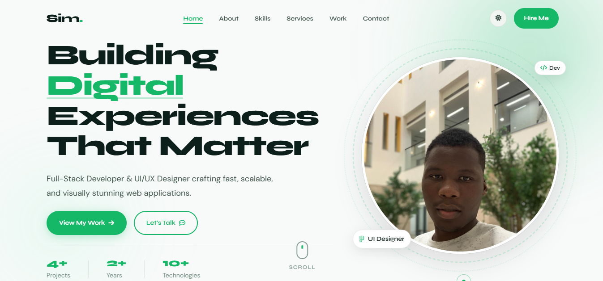

# 🌐 Personal Portfolio Website

<div align="center">

### ✨ Modern • Elegant • Responsive • Premium UI Experience ✨

A beautifully crafted **Personal Portfolio Website** built with **HTML5, CSS3, and JavaScript**, designed to showcase skills, projects, services, and contact information with smooth animations, dark mode, and an ultra-premium user experience.

<br>

<a href="https://simoyi-portfolio.vercel.app" target="_blank">
  
</a>

</div>

---

## 📸 Project Preview

<div align="center">



</div>

---

# ✨ Premium Features

## 🎯 Core Features

✔️ Fully Responsive on All Devices  
✔️ Sticky Navigation Bar  
✔️ Smooth Scroll Navigation  
✔️ Active Section Link Highlight  
✔️ Elegant Mobile Hamburger Menu  
✔️ Fast & Optimized Performance  

---

## 🎨 UI / UX Enhancements

✔️ Dark / Light Theme Toggle 🌙☀️  
✔️ Scroll Reveal Animations  
✔️ Smooth Hover Effects  
✔️ Animated Skill Progress Bars  
✔️ Scroll To Top Floating Button  
✔️ Hero Progress Indicator  

---

## 💼 Portfolio Sections

✔️ Hero Banner  
✔️ About Me Section  
✔️ Skills Showcase  
✔️ Services Section  
✔️ Featured Projects  
✔️ Call To Action Section  
✔️ Contact Form  
✔️ Footer Area  

---

## 📩 Contact System

✔️ Functional Contact Form  
✔️ Powered by **EmailJS**  
✔️ Toast Success Notifications  
✔️ Error Handling Alerts  

---

# 🛠️ Tech Stack

<div align="center">

| Technology | Usage |
|-----------|-------|
| HTML5 | Structure |
| CSS3 | Styling |
| JavaScript | Interactivity |
| Font Awesome | Icons |
| EmailJS | Contact API |

</div>

---

# 📁 Project Structure

```bash
portfolio/
│── index.html
│── style.css
│── script.js
│── README.md
│── imgs/
│   ├── ReadMe.png
│   ├── hero.jpg
│   ├── web-dev.png
│   ├── uiux.png
│   ├── graphic.png
│   └── seo.png
